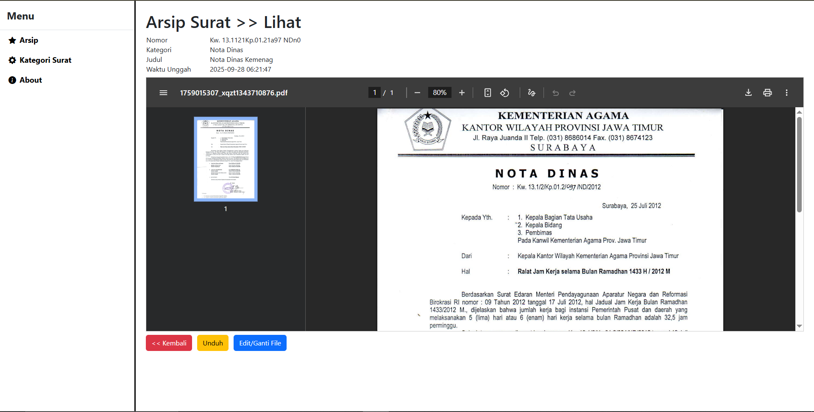

# Aplikasi Web Arsip Surat PDF

## Aplikasi Web Arsip Surat
Aplikasi berbasis web untuk mengarsipkan surat resmi dalam format PDF secara terstruktur. Proyek ini bertujuan untuk mempermudah proses penyimpanan, pencarian, dan pengelolaan surat secara digital, sehingga lebih efisien, cepat, dan mudah diakses.

## Fitur
- Upload surat resmi dalam format PDF.
- Pencarian surat berdasarkan judul.
- Unduh surat yang telah diarsipkan.
- Manajemen kategori surat.

##  Cara Menjalankan
1. Clone repo:
   ```bash
   git clone [https://github.com/AndhikaBagus115/Arsip_surat.git]
   cd arsip_surat

2. Install dependency:
   ```bash
   composer install
   
3. Copy file .env.example menjadi .env, lalu atur konfigurasi database:
   ```makefile
   DB_CONNECTION=mysql
   DB_DATABASE=aplikasi_arsip
   DB_USERNAME=root
   DB_PASSWORD=
   
4. Import database:
   `Download file arsip_surat.sql dari repository ini
   Import ke database Anda melalui phpMyAdmin atau terminal`
   
5. Generate key Laravel:
   ```bash
   php artisan key:generate
   
6. Jalankan server:
   ```bash
   php artisan serve
Akses di browser: http://localhost:8000

## Screenshot
### Arsip




### Kategori


### About

