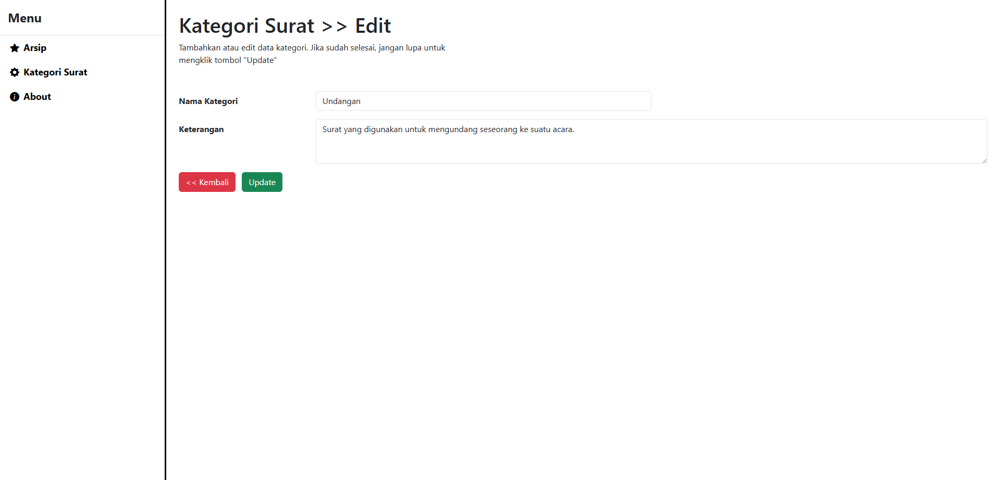

# Aplikasi Web Arsip Surat PDF

## Aplikasi Web Arsip Surat
Aplikasi berbasis web untuk mengarsipkan surat resmi dalam format PDF secara terstruktur. Proyek ini bertujuan untuk mempermudah proses penyimpanan, pencarian, dan pengelolaan surat secara digital, sehingga lebih efisien, cepat, dan mudah diakses.

## Fitur
- Upload surat resmi dalam format PDF.
- Pencarian surat berdasarkan judul.
- Unduh surat yang telah diarsipkan.
- Manajemen kategori surat.

## Cara Menjalankan
- Clone repository `git clone https://github.com/username/arsip-surat.git`, lalu `cd arsip-surat`
- Install Dependensi `composer install`
- Konfigurasi file .env `Duplikat file .env.example menjadi .env` Lalu sesuaikan konfigurasi database
- Lakukan import database `Download file arsip_surat.sql dari repository ini`, `Import ke database melalui phpMyAdmin atau terminal`
- lakukan `php artisan storage:link` untuk membuat link dari folder public dan storage
- lakukan `php artisan serve` untuk menjalankan laravel
- Akses aplikasi dengan browser dan kunjungi `http://localhost:8000`

## Screenshot
### Arsip

### Kategori

### About

