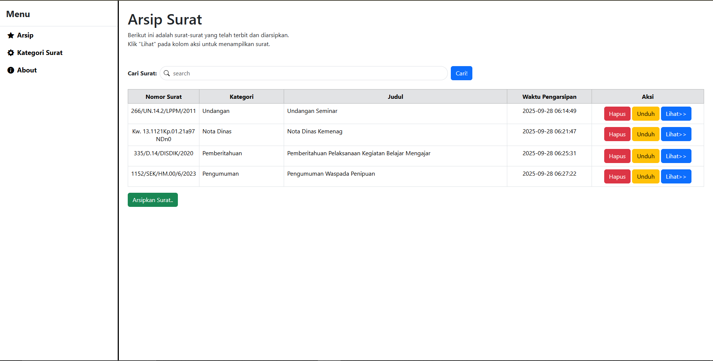
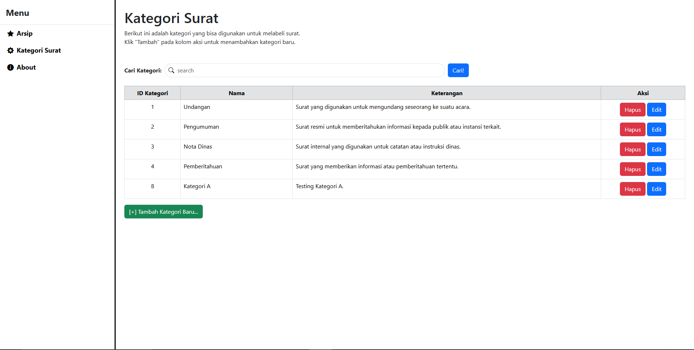

# Aplikasi Web Arsip Surat PDF

## Aplikasi Web Arsip Surat
Aplikasi berbasis web untuk mengarsipkan surat resmi dalam format PDF secara terstruktur. Proyek ini bertujuan untuk mempermudah proses penyimpanan, pencarian, dan pengelolaan surat secara digital, sehingga lebih efisien, cepat, dan mudah diakses.

## Fitur
- Upload surat resmi dalam format PDF.
- Pencarian surat berdasarkan judul.
- Unduh surat yang telah diarsipkan.
- Manajemen kategori surat.

## Cara Menjalankan
Clone repo:
[Git clone : https://github.com/AndhikaBagus115/Arsip_surat.git]
cd arsip_surat
Install dependency:
composer install
npm install && npm run build
Copy file .env.example menjadi .env, lalu atur konfigurasi database:
DB_DATABASE=aplikasi_arsip
DB_USERNAME=root
DB_PASSWORD=
Import database:
mysql -u root -p aplikasi_arsip < database/aplikasi_arsip.sql
Generate key Laravel:
php artisan key:generate
Jalankan server:
php artisan serve
Akses di browser: http://localhost:8000
## Screenshot
### Arsip

### Kategori

### About

